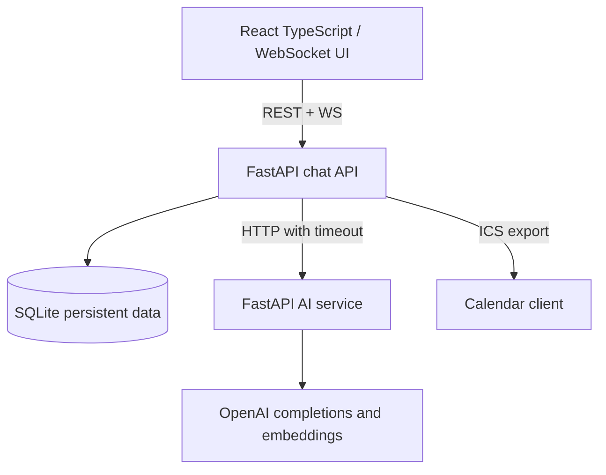
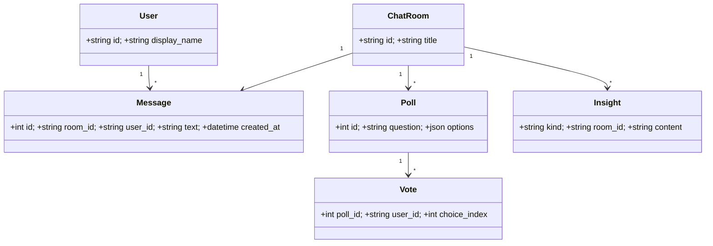
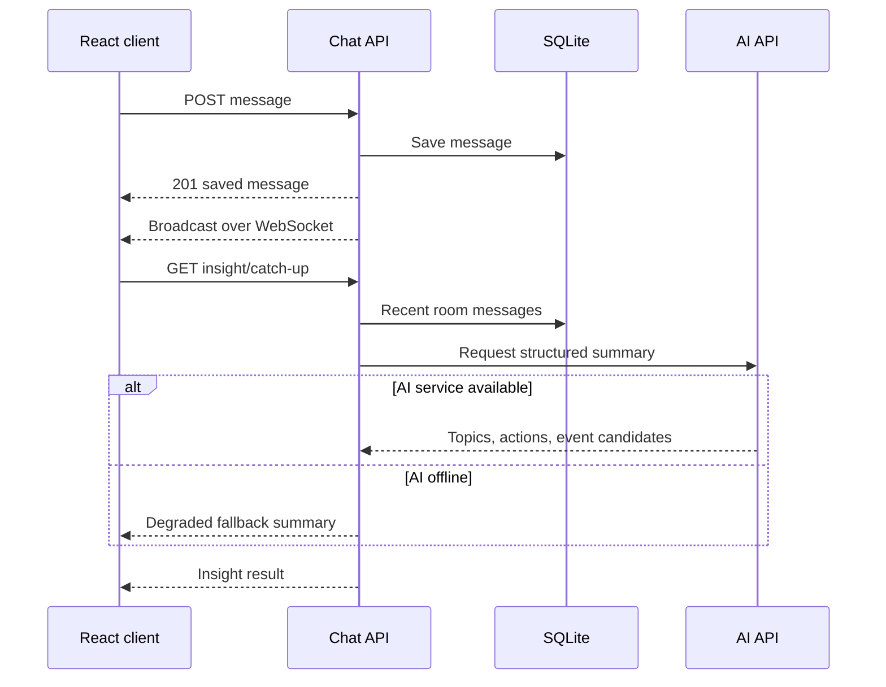
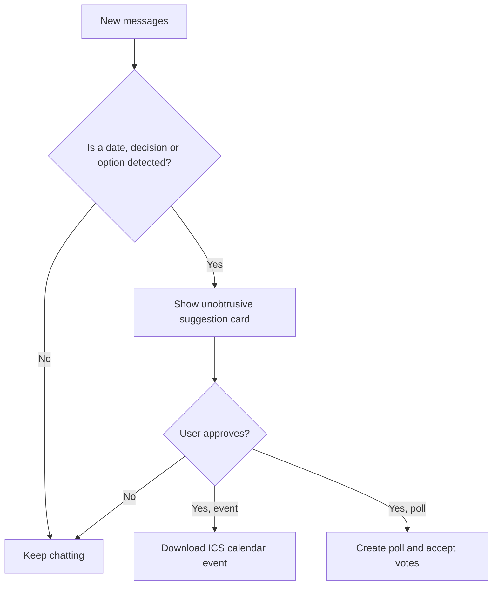

# System architecture

Use a **two-service backend**, not separate microservices for every feature: chat must remain functional if AI errors or times out.

## Code ownership
- `apps/chat-api/`: HTTP and WS endpoints, message/poll/event storage, AI client fallback. **Owner A**
- `apps/ai-service/`: summarise topics, semantic similarity, detect meetings/options. **Owner B**
- `apps/web/`: presentation, local demo persona, message subscriptions, insights. **Owner C**
- `docs/` and `scripts/`: smoke tests, demo and release. **Owner D**

## Class / domain model

## Message flow

## Intelligent nudges

## Data/security and scalability
SQLite is sufficient for the single demo instance; use PostgreSQL for multi-node production. In-memory WebSocket registries only broadcast to clients connected to the same chat instance; use Redis Pub/Sub at scale. Currently no secure identity, rate limits, tenant isolation or message encryption. Store no private data in demo chats. Make external AI calls timeout/fail gracefully.
