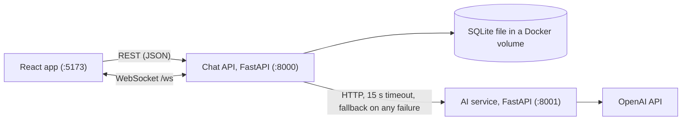
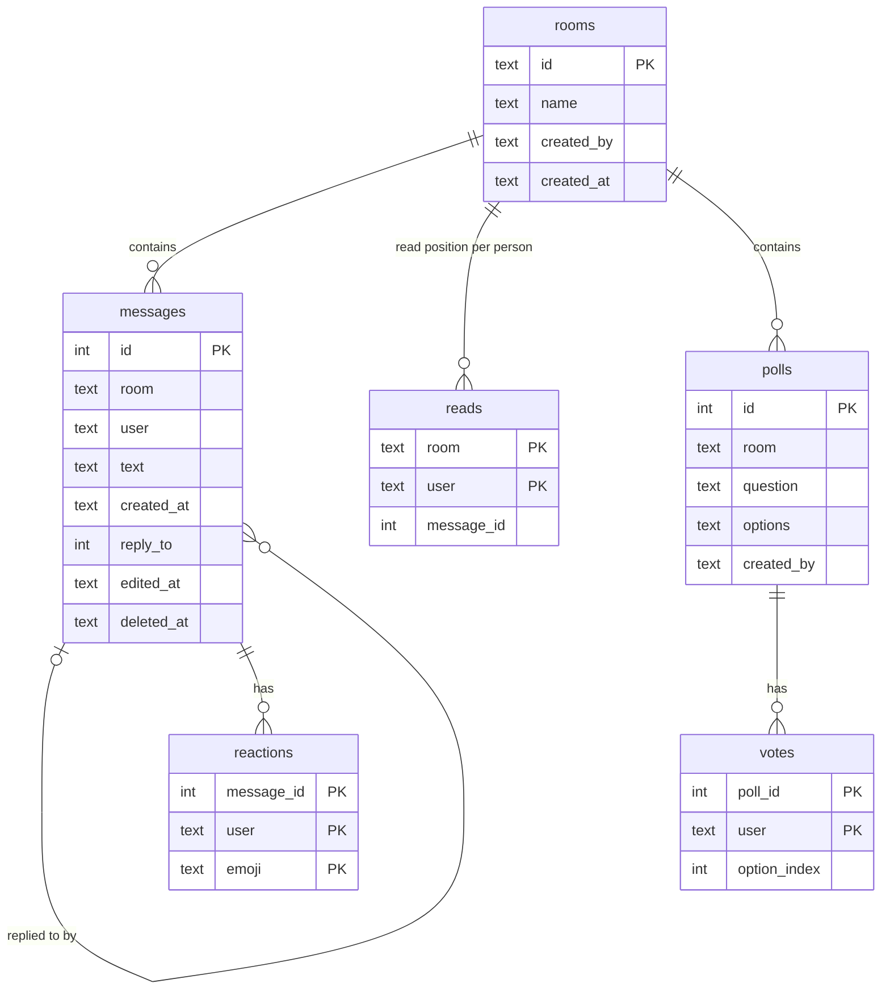
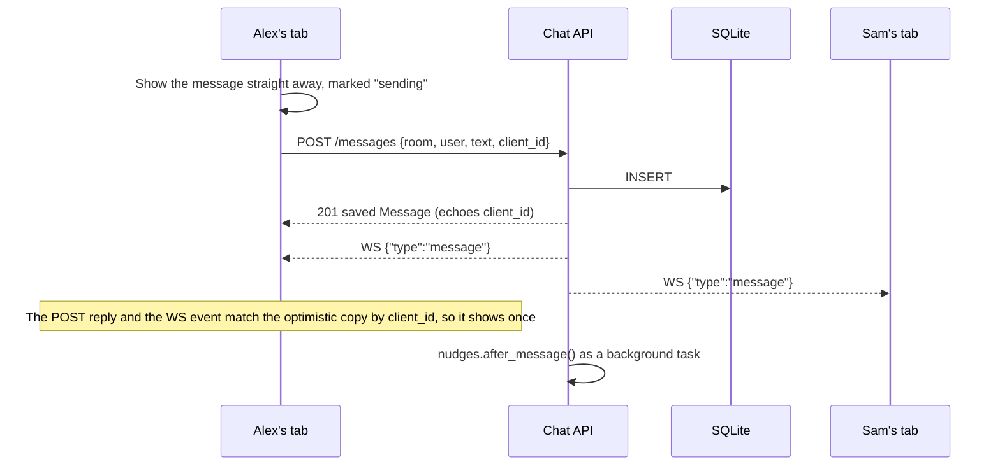
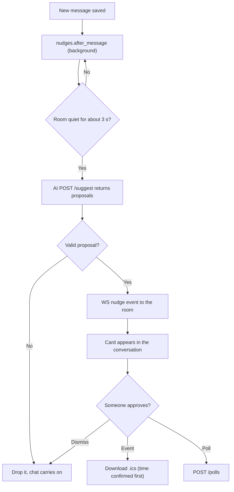

# System architecture

Describes the system as built in #38 (core messaging). Anything marked **planned** is not built yet.

## Shape

Two backend services and a web client. The browser only ever talks to the chat API; the AI service sits behind it.

Compose also publishes :8001 to the host so it can be tested directly. Nothing in the web app calls it.

## Why this shape

Judges ask teams to justify their choices. These are ours, and what each one costs.

| Choice | Why | What it costs |
|---|---|---|
| AI in its own service | Chat must keep working when OpenAI is slow or down. One HTTP boundary means one place to put a timeout and a fallback. Jin can build against fixtures without waiting on chat. | An extra network hop, and the Message shape is defined in two places (kept in step by `docs/CONTRACT_V1.md`). |
| Chat API is the only gateway | The OpenAI key never reaches a browser. The AI never writes to the database: it returns proposals, and a person approves them. | Every AI feature needs a matching chat route. |
| FastAPI for both services | REST and WebSockets in one async process. Pydantic validates every request and returns 422s on bad input. One framework for the whole team. | A single Python process; fine for one demo instance. |
| SQLite in WAL mode | No database server to run. One file in a Docker volume survives restarts. WAL lets reads continue during a write. | One writer at a time, one machine. |
| In-memory WebSocket hub | No message broker to install; broadcasting is a loop over connected clients. | Only clients connected to the same process receive events. |
| React, TypeScript, Vite, Motion | Typed API client and events. Motion's layout animations do the visible polish (a typing bubble that becomes the message, rooms reordering, read receipts moving). Respects the OS "reduce motion" setting. | Bundle is about 118 KB gzipped. |
| No accounts | Out of scope in `docs/PRODUCT_SPEC.md`. Demo identities only. | See the privacy notes below. |

## Code map

| Path | What it does |
|---|---|
| `apps/chat-api/main.py` | Routes, validation, WebSocket endpoint, AI gateway with fallbacks. |
| `apps/chat-api/store.py` | SQLite schema, migrations and every query. |
| `apps/chat-api/realtime.py` | WebSocket hub: connected clients, room filtering, presence, safe sends. |
| `apps/chat-api/nudges.py` | Hook that runs after each new message. Empty until the nudge pipeline lands (**planned**). |
| `apps/ai-service/main.py` | Digest, search (embeddings) and suggestions over the messages it is sent. |
| `apps/web/src/main.tsx` | App entry and the AI slots (see below). |
| `apps/web/src/chat/` | Chat UI: state reducer, WebSocket hook, API client, components. |
| `apps/web/src/defaults/` | Placeholder AI components until Vera's `features/` components replace them. |

## Data model

There is no users table: a user is the name the client sends. Room ids are slugs (`demo`, `pitch-practice`). Message ids are SQLite integers and only increase. All timestamps are UTC ISO 8601.

Migrations are a numbered list in `store.py`. `PRAGMA user_version` records how many have run, and each one runs in a transaction on startup. A database from the original scaffold upgrades in place.

## Sending a message

If the POST fails, the message stays in place marked "Not sent" with Try again. It is also resent automatically when the connection comes back.

## Live updates

The client connects to `/ws?user=Name`. The WebSocket URL is derived from the API URL (http becomes ws, https becomes wss). Without `room=`, a client gets events for every room, which is what keeps sidebar unread badges live.

| Server event | Sent when |
|---|---|
| `message` | A message is saved |
| `message_updated` | A message is edited, deleted or reacted to |
| `room` | A room is created |
| `read` | Someone's read position moves forward |
| `typing` | Someone starts or stops typing (not echoed to the sender) |
| `presence` | Someone connects or leaves; carries the full online list |
| `poll` | A poll is created or voted on |
| `pong` | Reply to the client's `ping` |
| `nudge` | **Planned**: an AI proposal for a room |

Clients send two events: `{"type":"ping"}` and `{"type":"typing","room":"demo","active":true}`.

**Server side:** each client has its own send lock and a 5 s send timeout. A tab that stops reading is dropped rather than holding up everyone else's broadcast.

**Client side:**
- The client pings every 20 s. If no pong arrives within 8 s, it treats the connection as dead.
- It reconnects with backoff from 0.5 s up to 8 s, with ±25% jitter, and reacts immediately to the browser's online and offline events.
- On every reconnect it refetches the room list and the latest page of each open room, then resends anything that failed.

## Where the AI plugs in

**Gateway routes.** Each sends the room's 100 most recent non-deleted messages, in the v1 Message shape only (`id, room, user, text, created_at`).

| Chat route | Calls | If the AI call fails |
|---|---|---|
| `GET /digest?room=` | `POST /digest` | `{"summary": "AI temporarily unavailable; chat remains operational."}` |
| `GET /search?query=&room=` | `POST /search` | Case-insensitive text match, `"mode": "keyword"` |
| `GET /suggest?room=` | `POST /suggest` | `{"suggestion": "No suggestion"}` |

**Nudges (planned).** These put the AI inside the conversation rather than behind a button, which is the "Invisible AI" theme.

**Web slots.** `apps/web/src/main.tsx` has one place where AI components plug in. Prop types are in `apps/web/src/chat/slots.ts`.

| Slot | Where it appears |
|---|---|
| `insights` | Side panel (catch-up, search, actions) |
| `nudge` | Inline card for each `nudge` event |
| `catchUp` | On the "new messages" divider when a room opens with unread messages |
| `composer` | Row above the message box, for smart replies |

## Configuration

| Variable | Service | Default | Purpose |
|---|---|---|---|
| `DB_PATH` | chat | `chat.db` (compose: `/data/chat.db` in volume `chatdata`) | SQLite file |
| `AI_URL` | chat | `http://localhost:8001` (compose: `http://ai:8001`) | AI service base URL |
| `CORS_ORIGINS` | chat | `http://localhost:5173,http://127.0.0.1:5173` (compose: `http://localhost:5173`) | Browser origins allowed to call the API |
| `VITE_CHAT_API_URL` | web, at build time | Same host as the page, port 8000 | Chat API base URL |
| `OPENAI_API_KEY`, `OPENAI_MODEL`, `OPENAI_EMBED_MODEL` | ai, from `.env` | No key; `gpt-4o-mini`; `text-embedding-3-small` | Without a key the AI service returns fallbacks |

**Two laptops on one network (untested).** The web app calls the API on whatever host served the page, so opening `http://<host-ip>:5173` on a second laptop already points it at `http://<host-ip>:8000`. Two changes are needed:
1. Add that origin to `CORS_ORIGINS` in `docker-compose.yml`, for example `http://localhost:5173,http://192.168.1.20:5173`.
2. Allow ports 5173 and 8000 through the host's firewall.

WebSockets aren't subject to CORS. If this doesn't work quickly, use two browser profiles on one laptop instead.

## Privacy and security notes

This is a demo, not a production system. These are the honest limits.

**Identity**
- There is no authentication. A user is whatever name the browser sends, from the picker or `?as=Name`.
- Anyone who can reach port 8000 can read every room and post, edit or delete as anyone.
- The "only the sender can edit or delete" check compares names. It stops mistakes, not attackers.

**Network**
- Plain HTTP and WebSocket, no TLS.
- Run it on localhost or a trusted network only, and don't deploy it publicly without adding auth first.

**What is stored**
- Messages, reactions, read positions, polls and votes live in SQLite inside the Docker volume `chatdata`.
- `*.db` files are gitignored, so no chat data is committed.
- The browser stores only the chosen demo name (sessionStorage and localStorage). Unsent drafts stay in memory.

**Deleting and editing**
- "Delete for everyone" erases the text in the database and removes the message's reactions.
- The row stays as a "Message deleted" placeholder so replies to it still make sense.
- Editing overwrites the text. No edit history is kept.

**What leaves the machine**
- When catch-up, search or suggestions run, the room's 100 most recent non-deleted messages go to OpenAI, a third party: names, text and timestamps. Nudges will do the same once built.
- Demo chats must use synthetic data only.
- Without `OPENAI_API_KEY`, nothing is sent.

**Secrets**
- `OPENAI_API_KEY` lives only in the AI service's `.env`, which is gitignored.
- No route returns it, and the browser never receives it.

**Prompt injection**
- Chat text is untrusted. The AI service's system prompt says so, but a prompt is not a guarantee.
- The real protection is structural: AI output is only ever a suggestion. It can't write to the database or call chat routes, and every poll or calendar event needs a person to click.

**Input limits**
- Names: 40 characters. Messages: 2,000. Room names: 60. Poll text: 200, with 2 to 10 options.
- Message pages: 100.
- There is no rate limiting.

**Logs**
- The chat API doesn't log message text.
- Uvicorn's access log records request URLs, so search queries and demo names appear in container logs.

## Scaling limits

| Limit today | Fine for the demo because | What production would need |
|---|---|---|
| One chat API process with the WebSocket hub in memory | One laptop, a few tabs | A shared channel between instances (Redis pub/sub or Postgres LISTEN/NOTIFY) |
| SQLite allows one writer | A handful of people typing | Postgres |
| Presence and typing live in memory and reset on restart | Clients reconnect and reappear within seconds | Redis keys with expiry |
| Search embeds the latest 100 messages on every query | 100 short messages is one cheap call | Embed each message once when saved (e.g. pgvector) and search all history |
| The AI sees only the latest 100 messages | The demo conversation fits | Rolling per-room summaries; catch-up from each person's read position (`reads`) |
| Reconnect refetches the latest page only | Edits to older messages during an outage are rare | Numbered events so a reconnect replays exactly what was missed |
| Names as identity, no permissions | Spec says demo identities | Real login (OIDC), room membership checked on every route and subscription, rate limits |

## Failure behaviour

| What fails | What people see |
|---|---|
| AI service or OpenAI down or slow | Chat is unaffected. AI routes return their fallback, immediately if the service is unreachable or after at most 15 s. |
| Chat API down | "Reconnecting to live updates…" banner. Sends are marked "Not sent" with Try again and resend automatically on reconnect. |
| Network drops silently (e.g. wifi) | Noticed within about 28 s by the missing pong, or at once via the browser's offline event |
| Bad input | 422 with the failing field |
| Editing or deleting someone else's message | 403. Editing a deleted message: 409. |
